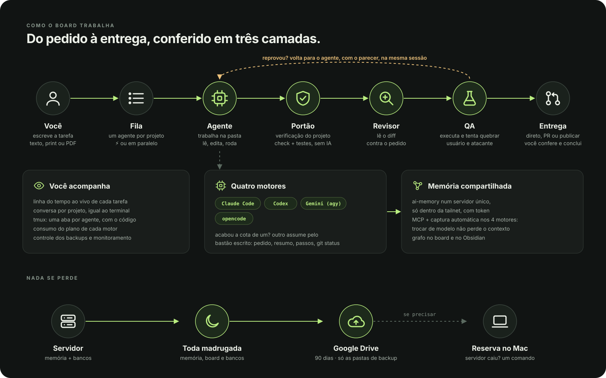
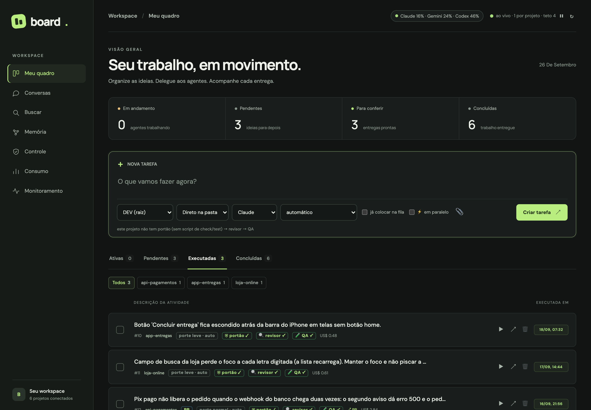
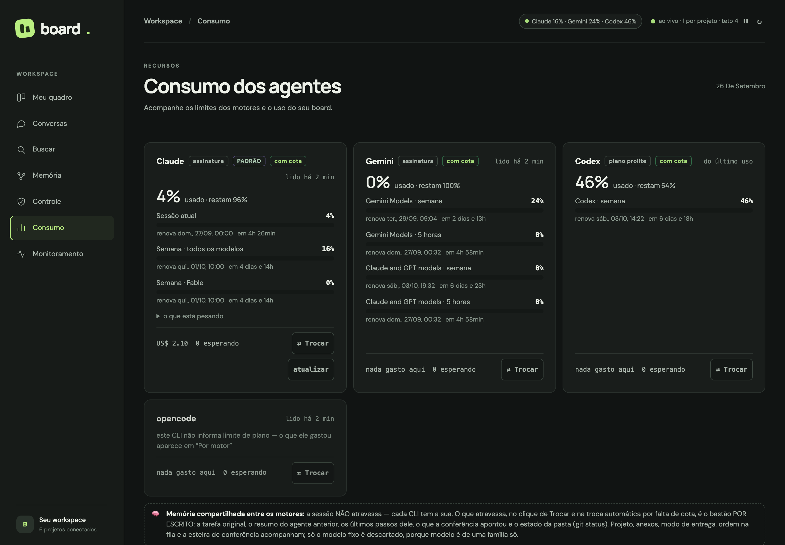
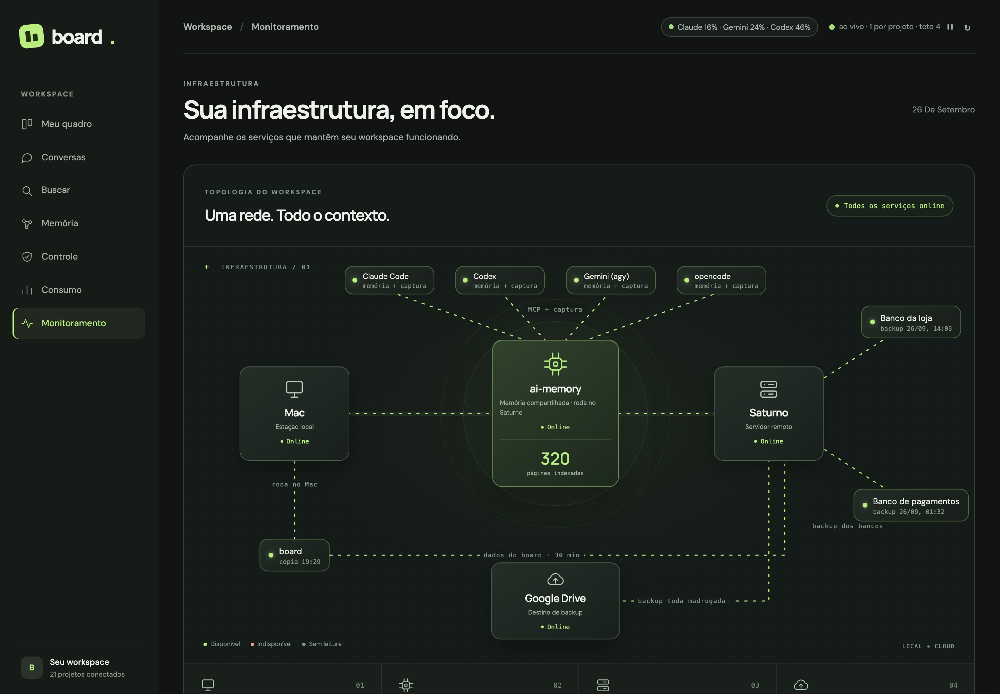

# board

[](LICENSE)
[](https://github.com/gilvanecesar/board-agentes/releases)
[](https://github.com/gilvanecesar/board-agentes/pkgs/container/board-agentes)
[](https://github.com/gilvanecesar/board-agentes/actions/workflows/testes.yml)
[](https://nodejs.org)
[](package.json)
[](#o-que-ele-faz)

**Português** · [English](README.en.md)

**Uma bancada local para trabalhar com agentes de IA em vários projetos ao mesmo tempo, com uma memória que não se perde.**

Você escreve a tarefa, ela entra numa fila, e um agente (Claude Code, Codex, Gemini ou opencode) trabalha na pasta
do projeto. Antes de a entrega chegar até você, o board confere o trabalho em três etapas: a verificação do próprio
projeto, um revisor que lê o diff e um QA que executa e tenta quebrar.

E toda tarefa começa com as **memórias certas**: o board trata a memória dos agentes como um **armazém (WMS)**,
com ruas, porta-paletes, endereço e romaneio, e separa para cada tarefa só o que ela precisa.

Roda na sua máquina, com Node puro: **nenhuma dependência npm**. A tela é um arquivo HTML, o servidor é um arquivo
`.mjs`, e o estado fica numa pasta `data/` fora do git.



> As imagens deste repositório são de um board de **demonstração**, com projetos e memórias fictícios.



---

## O que ele faz

| | |
|---|---|
| **Fila de tarefas por projeto** | Cada pasta ao lado do board é um projeto. Projetos diferentes rodam juntos; o mesmo projeto, um de cada vez (ou em paralelo, se você pedir). |
| **Esteira de conferência** | Em toda tarefa que mexe em arquivo: **agente → portão → revisor → QA**. Reprovou, volta para o agente na mesma sessão, com o parecer. Sem veredito legível conta como reprovado. |
| **Quatro motores** | Claude Code, Codex, Gemini (`agy`) e opencode. Acabou a cota de um, outro assume pelo **bastão escrito**: o pedido, o resumo, os últimos passos e o `git status`. |
| **Memória em galpão** | Ruas (projetos), **mentes** (assuntos) e paletes (memórias) com endereço. Vistas Grafo e Galpão. |
| **Romaneio** | Em cada tarefa, o board separa as memórias certas e manda junto, escritas no pedido. Funciona com qualquer motor. |
| **"Já tratei disso?"** | A busca mostra primeiro o que a memória já tem sobre o assunto. |
| **Conversa por projeto** | Um fio por projeto, igual ao terminal, para pensar junto antes de abrir tarefa. |
| **Agentes em paralelo** | `⚡ em paralelo` dá a cada tarefa o próprio agente (`#eng01`, `#eng02`…) numa cópia isolada (git worktree). |
| **Entrega** | Direto na pasta, por Pull Request, ou PR + mesclar + publicar (este só com comando autorizado por escrito). |
| **Consumo e controle** | O plano de cada motor, o gasto por papel, os backups e a memória, com alertas. |

---

## A memória como um armazém

Guardar memória é fácil. O difícil é **achar e separar a certa na hora certa**: o contexto de um agente é pequeno e
caro, e memória demais atrapalha tanto quanto memória de menos. Um WMS resolve exatamente isso num galpão, e a mesma
disciplina serve aqui.


- **Rua** = projeto (e uma **área comum**, que vale para todos).
- **Porta-palete** = uma **mente**, o assunto: produto, financeiro, design, engenharia, segurança…
- **Palete** = uma memória, com endereço `R03-P02-N1-02`. A cor é a idade; o nível 1 é o mais recente.
- **Recebimento**: um agente propõe a mente de cada memória, e o dono confere as duvidosas antes de aprovar.
- **Picking e romaneio**: em cada tarefa, o board escolhe as mentes e separa as memórias que ela pede.

**Grafo**: cada ponto é uma página, cada linha uma ligação.


**Galpão**: a mesma memória como armazém.


Na tarefa, o romaneio aparece na linha do tempo (📦), com cada memória que foi junto:


**Como funciona em detalhe, com todas as telas: [docs/MEMORIA.md](docs/MEMORIA.md).**

### Medição: a mesma tarefa, com e sem romaneio

Uma tarefa real do próprio board ("o anexo aceita só imagem e recusa o resto em silêncio"), rodada 4 vezes a partir
do **mesmo commit**, com o **mesmo modelo**: 2 sem romaneio (A) e 2 com (B). O romaneio de B só levou memórias que
já existiam antes da tarefa, para não dar "cola".

| | Custo | Turnos | Tempo | Tokens escritos |
|---|---|---|---|---|
| A1 (sem) | US$ 1,18 | 39 | 3min21 | 19.080 |
| A2 (sem) | US$ 1,35 | 52 | 3min51 | 19.382 |
| B1 (com) | US$ 1,18 | 47 | 2min59 | 15.472 |
| B2 (com) | US$ 1,19 | 45 | 3min23 | 16.525 |
| **Média A** | US$ 1,27 | 45,5 | 3min36 | 19.231 |
| **Média B** | **US$ 1,19 (−6%)** | 46 | **3min11 (−12%)** | **16.000 (−17%)** |

As quatro entregas passaram na mesma verificação.

**Leitura honesta:** a tendência favorece o romaneio (mais barato, mais rápido, menos texto gerado), mas com 2 rodadas
por lado a diferença ainda cabe no acaso: só entre A1 e A2 houve 13 turnos de diferença. E esta foi o pior caso
para ele, porque a memória não tinha nada sobre o assunto da tarefa. Em larga escala, 6% a 12% é muito dinheiro e
muito tempo; por isso a segunda medição teve mais rodadas.

### Segunda medição: o romaneio saiu mais caro

Outra tarefa do board ("busca e detalhe na lista de pendentes"), 4 rodadas por lado, mesmo commit e mesmo modelo.
O romaneio de B levou o núcleo de O Dono e memórias de engenharia e de telas.

| | Custo | Turnos | Tempo | Tokens escritos |
|---|---|---|---|---|
| **Média A (sem)** | US$ 2,04 | 57,5 | 4min51 | 24.948 |
| **Média B (com)** | US$ 2,50 (**+23%**) | 70,3 (**+22%**) | 6min32 (**+35%**) | 30.137 (**+21%**) |
| Faixa de custo | A: 1,72 – 2,39 | B: 2,35 – 2,58 | | |

**Qualidade: empate.** As 8 entregas passaram na verificação e num teste funcional no navegador. **Onde B gastou
mais:** os 4 agentes com romaneio criaram uma rota nova no servidor; entre os sem romaneio, só 1 criou (os outros
reaproveitaram o que já existia). Hipótese: regras gerais do dono ("executar o todo", "documentar tudo") empurram o
agente a fazer mais. E a busca por palavra não levou a regra que mais importava para a tarefa, porque o pedido dizia
a mesma coisa com outras palavras.

### Terceira medição: sem as regras gerais do dono, empate

A mesma tarefa, 4 rodadas por lado, mas o romaneio (C) levou só as memórias da tarefa, sem o núcleo de O Dono.

| | Custo | Turnos | Tempo | Tokens escritos |
|---|---|---|---|---|
| **Média A (sem)** | US$ 2,26 | 66 | 5min57 | 27.874 |
| **Média C (só as memórias da tarefa)** | US$ 2,23 (−2%) | 62 (−6%) | 6min29 (+9%) | 28.147 (+1%) |
| Faixa de custo | A: 2,00 – 2,44 | C: 1,87 – 2,44 | | |

Qualidade: empate de novo. Tirar o núcleo levou de +23% a empate, o que apoia a hipótese de que regras gerais em toda
tarefa empurram o agente a fazer mais. Mas o próprio A variou 11% entre a 2ª e a 3ª medição: com 4 rodadas, "empate" é
o máximo que dá para dizer.

**Conclusão das três medições:** não há prova de que o romaneio economize, e o núcleo fixo custa caro em tarefa pequena.
O romaneio pode ser desligado (`BOARD_ROMANEIO=0`) ou usado sem núcleo (deixe `nucleoDono` vazio no `mentes.json`).
Desde então o romaneio separa também **por sentido** (embeddings no ollama local, `bge-m3`): numa memória real, com
10 pedidos escritos com outras palavras, achou a memória certa em 8/10, contra 5/10 só por palavra. Detalhes em
[docs/MEMORIA.md](docs/MEMORIA.md).

### Quarta medição: o romaneio novo, COM o núcleo do dono — empate

A mesma tarefa, 4 rodadas por lado, agora com o romaneio por palavra **e sentido** e o bônus de projeto corrigido. O núcleo
de regras do dono foi junto (na 2ª medição, com o romaneio antigo e o núcleo, tinha custado 23% a mais).

| | Custo | Turnos | Tempo | Tokens escritos |
|---|---|---|---|---|
| **Média A (sem)** | US$ 2,21 | 61,3 | 5min21 | 27.237 |
| **Média D (romaneio novo, com núcleo)** | US$ 2,19 (−1%) | 61,8 (+1%) | 5min01 (−6%) | 25.927 (−5%) |
| Faixa de custo | A: 1,84 – 2,56 | D: 1,93 – 2,45 | | |

Qualidade: empate (8 de 8 na verificação e no teste funcional). Trocar 5 memórias soltas por 5 ligadas ao pedido tirou o
sobrecusto — com o núcleo e tudo. Com 4 rodadas por lado, **empate** é o máximo que dá para dizer: nenhuma das quatro
medições mostrou economia, e a última deixou de mostrar custo a mais.

---

## Instalação

### 1. Requisitos

O board **abre e roda tarefas** só com o primeiro grupo. Os outros ligam partes dele.

**Obrigatórios**

| Ferramenta | Para quê |
|---|---|
| **Node.js 20+** | o servidor e a CLI |
| **[Claude Code](https://docs.claude.com/claude-code)** (`claude`), logado | motor padrão, revisor e QA |
| `git` | projetos, agentes em paralelo, PR |

**Recomendados** (a experiência completa)

| Ferramenta | O que liga |
|---|---|
| `tmux` | `board agentes`: uma aba por agente, mostrando o código que ele escreve |
| [`ai-memory`](https://github.com/akitaonrails/ai-memory), de **Fabio Akita** | o servidor da memória compartilhada (menus Memória e Controle). Instale pelo release dele; a montagem de servidor, backup e reserva está em [`memoria/`](memoria/) |
| [Obsidian](https://obsidian.md) | ver a memória como cofre. O grafo do board **não** depende do app, só do espelho que o `memoria-obsidian` cria |
| [`gh`](https://cli.github.com), logado | entrega por Pull Request |
| `rclone` com um remoto `gdrive_backup` | backups no Google Drive e a reserva da memória |
| `codex`, `agy`, `opencode` | motores extras e troca automática quando a cota acaba |
| um servidor sempre ligado, por SSH | onde a memória e os backups rodam. Apelido em `BOARD_SERVIDOR` |

**Opcionais**

| Ferramenta | O que liga |
|---|---|
| `ollama` com `bge-m3` | busca de tarefas e romaneio por sentido (`ollama pull bge-m3`). Sem ele, vai por palavra, e a tela avisa |

### 2. Onde colocar

O board trata como **projeto** cada pasta **ao lado dele** que tenha `.git`, `CLAUDE.md` ou `package.json`:

```
~/projetos/
├── board/            ← este repositório
├── loja-online/      ← vira projeto "loja-online"
└── api-pagamentos/
```

```bash
cd ~/projetos
git clone https://github.com/gilvanecesar/board-agentes board
cd board
cp board.env.exemplo board.env    # opcional
./board.sh                        # http://localhost:4488, e se mantém no ar
```

Não há `npm install`: o board não tem dependência.

### Ou com Docker (tudo junto: Node, git, tmux e o Claude Code)

```bash
docker run -d --name board -p 127.0.0.1:4488:4488 \
  -e CLAUDE_CODE_OAUTH_TOKEN="$(cat ~/.claude-token)" \
  -v ~/projetos:/projetos -v board-data:/app/data \
  ghcr.io/gilvanecesar/board-agentes:latest
```

ou `docker compose up -d` com o [`docker-compose.yml`](docker-compose.yml). O Claude Code dentro do container precisa
de **uma** credencial: `CLAUDE_CODE_OAUTH_TOKEN` (para usar o seu plano, gere com `claude setup-token`) ou
`ANTHROPIC_API_KEY`. A porta fica **só no 127.0.0.1** da sua máquina, de propósito. Os projetos vêm montados em
`/projetos`; o quadro e as configurações ficam no volume `board-data`. A entrega por PR precisa do `gh`, que não vem
na imagem: sem ele, use a entrega direto na pasta.

### 3. O comando `board` (opcional)

```bash
cp board ~/.local/bin/board        # ou outro diretório no seu PATH
board                              # sobe e mantém no ar
board abrir                        # abre no navegador
```

---

## Uso no terminal

```bash
board list                          # o quadro
board add "texto" <projeto>         # --fila (roda já) · --pr (entrega por PR) · --paralelo (⚡ agente próprio)
board show 42                       # a linha do tempo da tarefa
board run 42 · stop 42 · done 42 · rm 42
board say 42 "use a função que já existe em utils"
board pausar · retomar
board reiniciar                     # sobe código novo quando nada estiver rodando
board agentes                       # tmux: uma aba por agente
```

---

## Configuração

### `board.env`

| Variável | Padrão | O que faz |
|---|---|---|
| `BOARD_PORT` | `4488` | porta da tela |
| `BOARD_MODELO` | padrão do CLI | modelo do agente |
| `BOARD_MODELO_REVISOR` / `BOARD_MODELO_QA` | `sonnet` | modelo da conferência |
| `BOARD_PARALELO` / `BOARD_POR_PROJETO` | `4` / `1` | teto geral / agentes por pasta |
| `BOARD_MOTOR` | `claude` | motor padrão (`codex`, `gemini`, `opencode`) |
| `BOARD_REVISOR` / `BOARD_QA` | ligados | `0` desliga a etapa |
| `BOARD_TIMEOUT_MIN` | `45` | tempo máximo por tarefa |
| `BOARD_PRODUCAO` | — | projetos que **sempre** trabalham em cópia e entregam por PR |
| `BOARD_DONO` | — | o seu nome, nas regras dos agentes |
| `BOARD_ROMANEIO` | ligado | `0` desliga o romaneio |
| `BOARD_SERVIDOR` | `saturno` | apelido SSH do servidor (Monitoramento e Controle) |
| `BOARD_ESPELHO_MEMORIA` | `~/Documents/Memoria/ai-memory` | onde está o espelho da memória |
| `BOARD_BUSCA_PROVEDOR` | `ollama` | `ollama`, `openai`, `cohere` ou `lexico` |

### Arquivos em `data/` (fora do git)

| Arquivo | Para quê |
|---|---|
| `mentes.json` | as mentes, a mente de cada projeto, as pistas, os temas e o endereçamento aprovado. Exemplo: [`docs/mentes.exemplo.json`](docs/mentes.exemplo.json) |
| `backups.json` | os backups que o Controle acompanha. Exemplo: [`docs/backups.exemplo.json`](docs/backups.exemplo.json) |
| `portao.json` | o comando de verificação de cada projeto: `{"loja-online": "npm run check && npm test"}` |
| `deploy.json` | o comando de publicação. **Nasce vazio de propósito:** escrever ali é autorizar o board a publicar sozinho |
| `modelos.json` | o modelo de cada porte nos motores que não são o Claude |

---

## Mais telas

**Consumo**: o plano de cada motor, lido do próprio CLI, e o gasto do board por papel.



**Monitoramento**: o mapa do sistema inteiro, com o estado lido de verdade: os 4 motores ligados à memória, o
board copiando os dados para o servidor, os bancos mandando backup, e o servidor levando tudo ao Drive.
Verde, vermelho ou cinza (sem leitura). *(Neste print, os nomes dos bancos foram trocados.)*



**"Já tratei disso?"**: a busca mostra primeiro o que a memória tem.


---

## Segurança e limites

- **Local.** A tela escuta só em `127.0.0.1`. Quem abre a tela manda agentes rodarem comandos nas suas pastas: não exponha a porta.
- **O agente não mescla nem faz deploy sozinho.** A entrega por PR para no PR; publicar exige o comando em `data/deploy.json`, portão verde e revisor aprovado.
- **Uma tarefa abre um PR só.** As rodadas de conserto continuam na branch do PR que já existe.
- **Sem credenciais no repositório.** Tokens e chaves ficam nos próprios CLIs ou em arquivos `600` fora do repo.
- **Monitoramento e Controle** esperam um servidor alcançado por SSH (`BOARD_SERVIDOR`), com os logs de backup em `/var/log/backup-*.log`. Sem isso, essas duas telas mostram "sem leitura", e o resto funciona normalmente.

---

## Como é feito

| Arquivo | Papel |
|---|---|
| `board.mjs` | a entrada: carrega `servidor/` e sobe a porta e a fila |
| `servidor/` | um módulo por assunto: configuração, estado, projetos e cópias, motores, regras, esteira, conversa, fila, tarefas, uso e cota, memória, controle, monitoramento, anexos, HTTP |
| `web/` | a tela, sem build: `index.html` (esqueleto), `estilo.css` e um script por tela em `js/` |
| `board-cli.mjs` | a CLI `board` |
| `busca.mjs` | busca de tarefas por sentido (embeddings), com recuo para busca por palavra |
| `board.sh` | mantém o servidor no ar; o reinício pedido pela tela sai com código 75 e volta em 1 s |
| `memoria/` | a montagem da memória compartilhada: servidor, backup, reserva e espelho |
| `test/` | 145 testes (`npm test`, ~50 s, só `node:test`): as funções que decidem sozinhas, o board inteiro numa caixa isolada com `claude`, `codex`, `agy`, `opencode`, `ai-memory`, `ssh`, `rclone` e `docker` falsos que falam o formato real de cada um, e a tela num Chrome sem janela — sem agente de verdade, sem custo. Cobertura medida: 95% das funções do servidor e 94% das da tela |

**Os testes mordem:** 61 defeitos plantados de propósito (veredito que aprova sem veredito, produção rodando na pasta
do dono, portão ignorado, HTML do agente executando na tela, memória apagada sem confirmação, backup manual contado como
automático…) e os 61 reprovaram. O GitHub roda a bateria em todo PR.
**Reorganizar sem mudar nada:** `npm run fotografia` grava o conteúdo e o estilo de 32 telas e 19 rotas, com dados fixos e
relógio parado; antes e depois de mexer, as duas têm de sair idênticas.

Licença: [MIT](LICENSE).

---

## Créditos

- **[ai-memory](https://github.com/akitaonrails/ai-memory)**, de **Fabio Akita** ([@akitaonrails](https://github.com/akitaonrails)), licença MIT:
  a memória de longo prazo compartilhada entre os agentes, com MCP e captura automática. É ela que o board lê para
  desenhar o grafo e o galpão, separar o romaneio e conferir os backups. O board **não inclui nem modifica** o
  ai-memory: ele se instala à parte, pelo release oficial.
- **Nosso:** o board e a montagem em [`memoria/`](memoria/) (servidor, backup, reserva e espelho), e a ideia de tratar a
  memória como um armazém: mentes, endereço, romaneio.
- Os motores são os CLIs dos próprios fabricantes: [Claude Code](https://docs.claude.com/claude-code) (Anthropic),
  [Codex](https://github.com/openai/codex) (OpenAI), Antigravity/`agy` (Google) e [opencode](https://github.com/sst/opencode).
  O board só os chama; cada um tem a própria conta, o próprio plano e os próprios termos.
