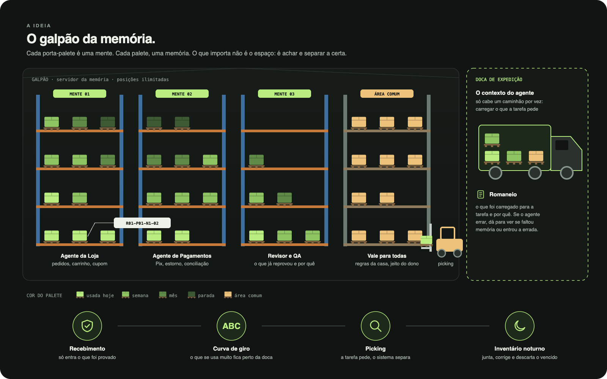
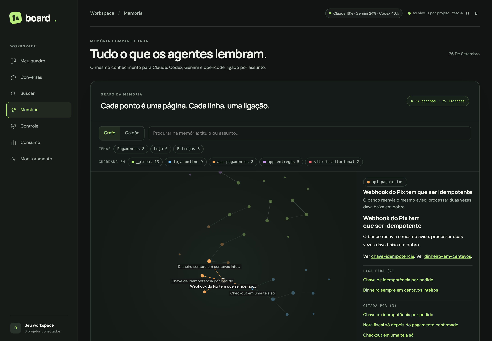
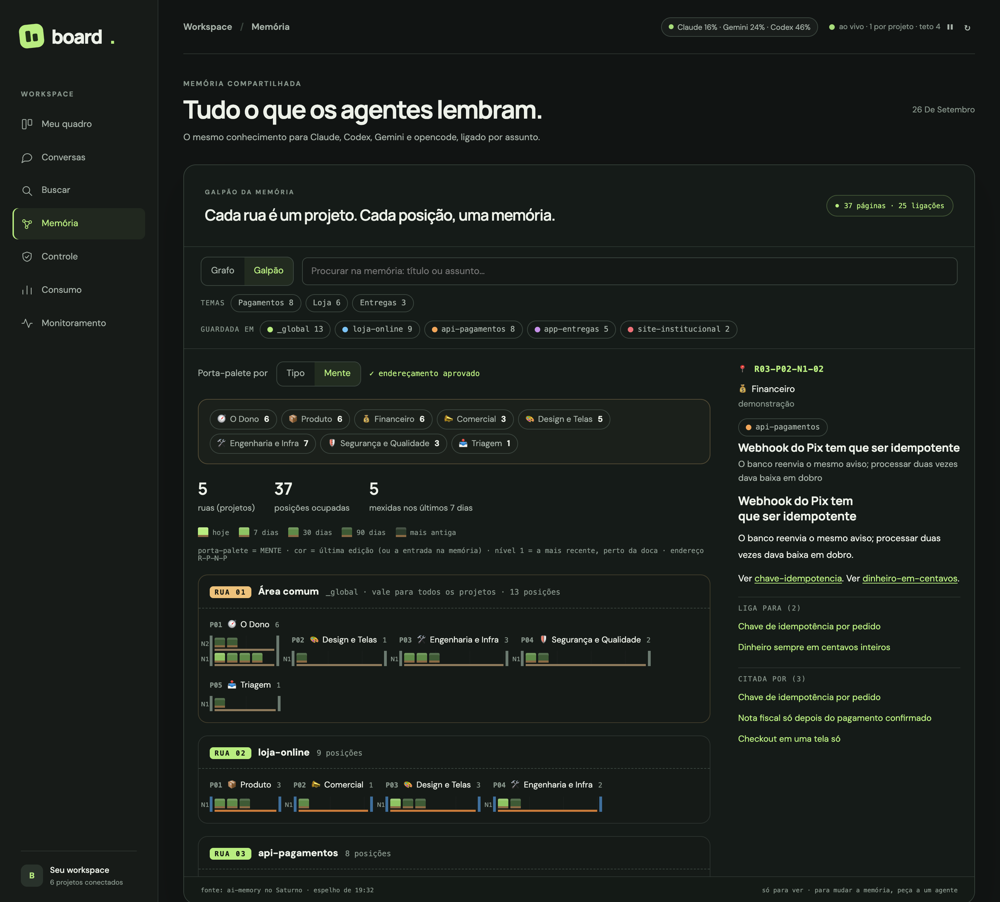
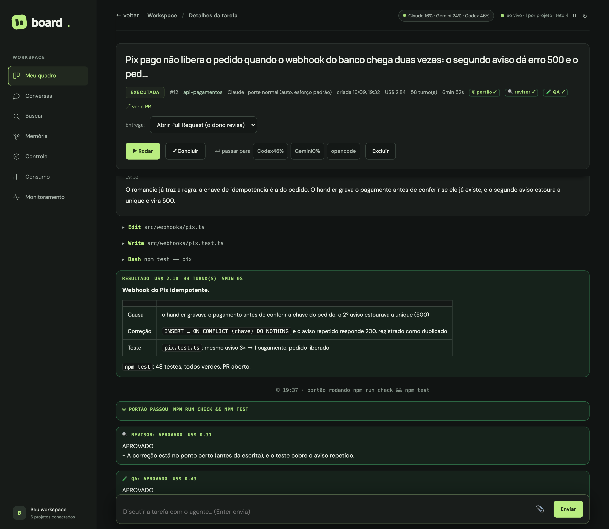
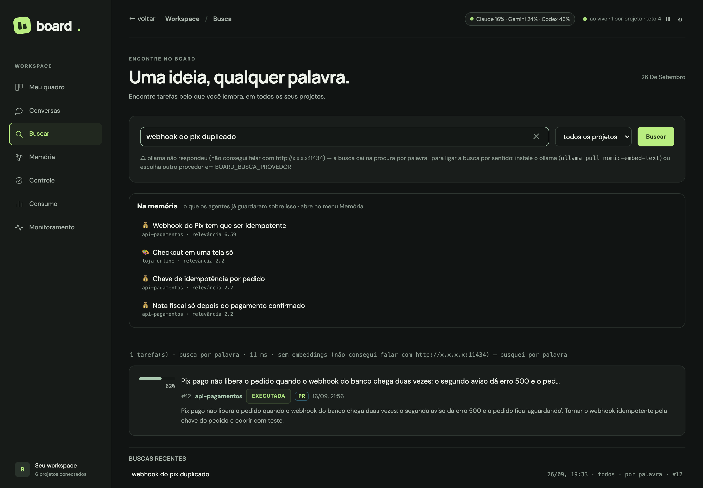

# A memória: o galpão, as mentes e o romaneio

O board usa uma memória **compartilhada entre os motores** (Claude, Codex, Gemini e opencode): o que um aprende, o
outro sabe. Quem guarda é um servidor [ai-memory](https://github.com/akitaonrails/ai-memory), de **Fabio Akita** (MIT), sempre ligado; a
montagem (servidor, backup, reserva e espelho) está em [`memoria/`](../memoria/).

Guardar é a parte fácil. O difícil é **achar e separar a memória certa na hora certa**. Por isso o board trata a
memória como um **armazém (WMS)**.

| No armazém | Na memória | No board |
|---|---|---|
| **Galpão** | toda a memória | o servidor de memória |
| **Rua** | um projeto | cada projeto, e a **área comum** (`_global`), que vale para todos |
| **Porta-palete** | uma **mente**, o assunto | as mentes de `data/mentes.json` |
| **Palete** | uma memória | uma página, com endereço `R03-P02-N1-02` |
| **Recebimento** | só entra o que foi conferido | o endereçamento proposto é conferido e aprovado |
| **Curva de giro** | o que se usa muito fica perto da doca | nível 1 = a memória mais recente |
| **Picking** | a tarefa pede, o sistema separa | o **romaneio** |
| **Doca** | o caminhão que sai | o contexto do agente |
| **Inventário** | conferir, juntar, descartar | o inventário noturno (painel 🌙 no Galpão) |

> As telas abaixo são de um board de demonstração, com projetos e memórias fictícios.

---

## 1. Ver a memória: Grafo e Galpão

Menu **Memória**.

**Grafo**: cada ponto é uma página, cada linha uma ligação `[[…]]`. Filtra por tema e por onde a página está
guardada; clicar abre a página ao lado.

**Galpão**: a mesma memória como armazém. O porta-palete pode ser o **tipo** (fatos, regras, decisões…) ou a
**mente**. A **cor é a idade real** da memória, lida de dentro dela (`modified`, ou quando entrou na memória).
Clicar num palete abre a memória com o endereço no topo.

---

## 2. As mentes

A rua diz **onde** a memória nasceu. A mente diz **do que** ela trata, e o mesmo porta-palete aparece em várias ruas:
uma lição de pagamento aprendida num projeto serve para o outro.

Sem configuração, o board usa estas mentes: **O Dono** (área comum: como você trabalha; vai em toda tarefa),
**Produto**, **Financeiro**, **Comercial**, **Design e Telas**, **Engenharia e Infra**, **Segurança e Qualidade**
(a mente do revisor e do QA) e **Triagem** (sem mente clara: ninguém carrega). Troque ou acrescente as suas em
`data/mentes.json` (veja o [exemplo](mentes.exemplo.json)).

**Endereçamento:** um agente lê as memórias e propõe a mente de cada uma, com a confiança. As de confiança média ou
baixa aparecem numa lista no Galpão: ✓ confirma, o seletor move. Depois de todas conferidas, **Aprovar**. O romaneio
só usa endereçamento aprovado.

---

## 3. O romaneio

Na **primeira rodada** de cada tarefa (ou quando outro motor assume), o board faz o picking e manda as memórias
**escritas no pedido**. Funciona com qualquer motor, até sem MCP.

1. **Escolhe as mentes:** a do projeto (`mentePorProjeto`), mais as que o pedido cita (as **pistas** de cada mente).
2. **Separa as memórias:** dentro dessas mentes, as mais ligadas ao pedido. A palavra rara vale mais que a comum, e
   onde ela aparece conta: título 3×, descrição 2×, texto 1×. Até 6.
3. **O Dono vai sempre**: o núcleo fixo (`nucleoDono`), mais as regras dele ligadas ao pedido.
4. **Registra** na tarefa: 📦 *romaneio · N memórias · ~X tokens · mentes*, cada memória clicável.

Cerca de 1.900 tokens, com picking **sem IA** (custo zero). Na retomada, não reenvia: a sessão já tem.
Desligar: `BOARD_ROMANEIO=0`.

**Prévia:** `GET /api/romaneio/previa?texto=…&projeto=…` mostra o que um pedido carregaria. Com `todas=1`, procura
em todas as mentes; com `ate=AAAA-MM-DD`, só no que já existia naquela data (para comparar antes e depois).

---

## 4. "Já tratei disso?"

A aba **Buscar** usa o mesmo picking em **todas** as mentes e mostra primeiro o que a memória já tem sobre o assunto.
Depois vêm as tarefas.

---

## Limites

- **O romaneio não economizou.** Na 1ª medição (2 rodadas por lado) foi 6% mais barato, dentro do acaso; na 2ª
  (4 rodadas por lado) foi **23% mais caro e 35% mais lento**, com a mesma qualidade; na 3ª, sem o núcleo de O Dono,
  empatou (−2%). Números no [README](../README.md).
- **O núcleo de "O Dono" é escolhido à mão:** as regras dele são gerais, e a busca por palavra não sabe quais pesam
  mais; por isso `nucleoDono` (no `mentes.json`) lista as que vão sempre. Regra de um projeto só leva `soNoProjeto: true`.
- **O romaneio só ajuda quando a memória tem o assunto.** Numa tarefa sobre algo nunca tratado, ele leva memória geral.
- **Inventário noturno** (painel 🌙 no Galpão): toda madrugada, sem IA, acha memórias novas sem mente, suspeitas de
  repetição e vencidas. Nada muda sozinho: "Juntar" pede a uma IA a versão única e mostra antes de aplicar; "Descartar"
  guarda uma cópia; "Não são"/"Manter" não voltam. O revisor e o QA do board rodam sem captura, para não virarem memória.
